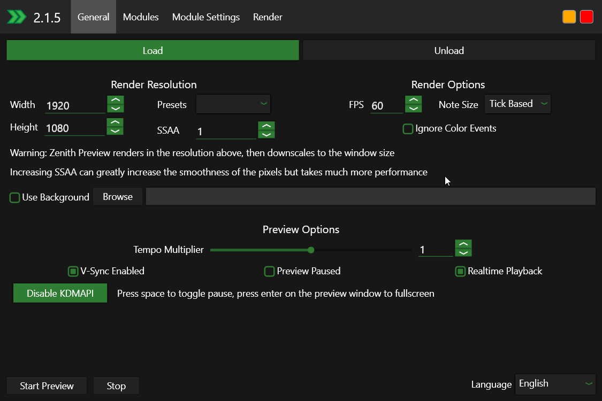

# Getting Started
This guide will get you started with Zenith.

??? note "System Requirements"

    Zenith's requirements aren't really known, in general you should want:
    - x86 or x64 processor running at 1.5 GHz
    - 4 GB of memory
    - Graphics card that supports OpenGL 3.0 or later
    - Windows 10 or up

## Installation

!!! note "Vanilla only"

    As said in the first page, this guide will only focus on the vanilla version, not the modded version.

First, download the Zenith Installer by clicking [here.](https://github.com/arduano/Zenith-MIDI/releases/download/2.1.5/ZenithInstaller.exe)
You should see a new window, don't kill it as it's purpose is to install Zenith on your computer.

Once it's done, you will see a new Zenith icon on your desktop.

## First Launch

When opening zenith, you will see this:

